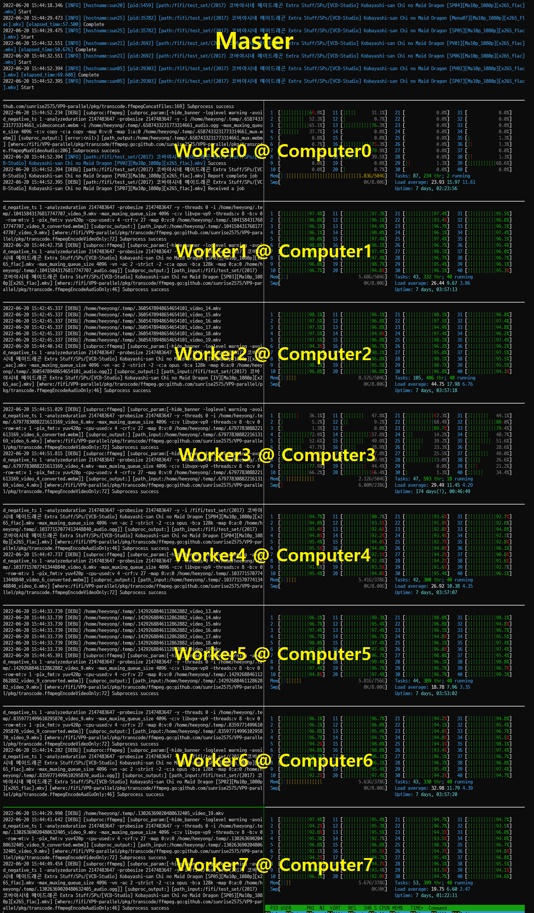

# dist-ffmpeg

- Go, FFmpeg, ZeroMQ 를 사용해서 만든 고속 분산 병렬 transcoding system

- 웹브라우저에서 재생되는 압축률 좋은 코덱 WebM VP9으로 변환시키는데에 특화되어 있습니다.

- 이미지, 오디오, 비디오 3가지 종류의 파일을 transcoding 가능합니다.

## Motivation

- 웹에서 작동되는 비디오 코덱은 H264, VP8, VP9, AV1 정도가 있음

- AV1과 VP9 코덱은 낮은 용량에 고화질임

- AV1 코덱은 인코딩/디코딩이 쓸 수 없을정도로 오래 걸리며, 모바일용 하드웨어 디코더가 많이 퍼지지 않았음. 따라서 VP9이 합리적

- VP9 코덱은 전용 하드웨어 인코더가 엄청나게 비쌈. CPU로 인코딩 필요

- ffmpeg의 기본 인코더 (libvpx-vp9) 사용하면 최대 8개 hardware thread 만 활용

- 파일을 divide-and-conquer 할 경우 비슷한 용량을 가지면서도 hardware thread 를 많이 사용하기 때문에 속도가 2~3배 빨라진다는 것을 발견 (성능에 관해서는 [리포트](./REPORT.md) 참고하세요.)

- 이런 divide-and-conquer 방식 및 여러개의 computer를 이용해 분산 처리하여 transcoding에서 높은 throughput 달성

## System Concept

- Apache Spark와 비슷하게, 1개의 master, n개의 worker가 존재

- Worker는 master와 접속되는 어떠한 computer에도 존재 가능

- 1대의 computer에 여러개의 worker가 동작 가능

- 서로 NFS 등으로 파일이 담겨있는 경로를 일치시켜야 함

- Worker는 임시폴더를 활용해 처리 중 NFS traffic을 사용하지 않음

- Worker는 받은 파일에 대해 `config.json` 을 참고하여 ffmpeg parameter를 결정하고 best-effort로 transcoding 수행

- Master나 worker를 켜는 순서는 상관이 없고, master가 켜져 있으면 worker를 아무 때나 붙일 수 있음. Worker를 켜면 자동으로 작업을 받아 수행합니다

- 파일이 transcode 전/후 코덱이 같으면 skip. 실패한 파일은 자동으로 넘어감

## System Demo Image


 
## Preparation

Ubuntu 18.04 기준입니다.

1. NFS 설치
    ```bash
    sudo apt install nfs-kernel-server nfs-common -y
    ```
    master에는 `sudo vim /etc/exports/` 수정하여 NFS connection open하고 `sudo exportfs -r` 명령으로 적용

2. Go 설치
    ```bash
    sudo add-apt-repository -y ppa:longsleep/golang-backports
    sudo apt update -y
    sudo apt install golang-go -y
    ```

3. FFmpeg 설치
    ```bash
    sudo add-apt-repository -y ppa:savoury1/ffmpeg4
    sudo apt-get update -y
    sudo apt-get install ffmpeg -y
    ```

4. ZeroMQ 설치
    ```bash
    sudo apt install libzmq3-dev -y
    ```

## Usage

- Master side
    ```bash
    chmod 755 ./run_master.sh && ./run_master.sh <디렉터리>
    ```

- Worker side
    ```bash
    chmod 755 ./run_worker.sh && ./run_worker.sh <master IP>
    ```

## Copyright

Copyright (c) 2022 All rights reserved by Heeyong Yoon
