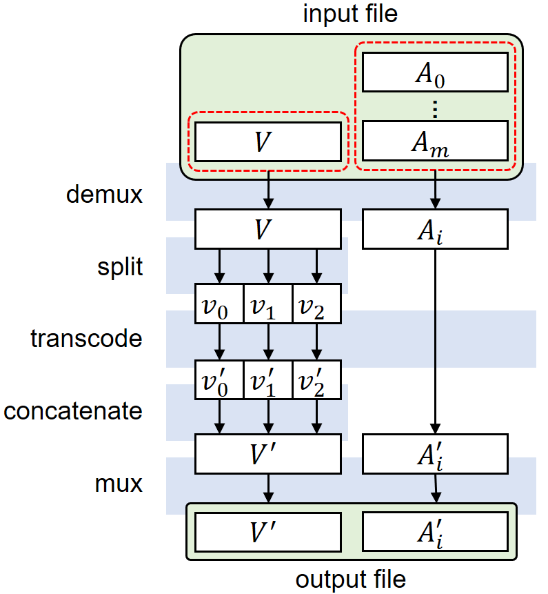

# Parallel solution for transcoding video as VP9 codec (in Progress)

## Abstract

VP9 코덱으로 영상 트랜스코딩 할 때 속도가 느린 단점을 개선한 프로그램 (개발 진행중)

## Introduction

트랜스코딩(transcoding)이란 하나의 영상 코덱(codec)에서 다른 영상 코덱으로 데이터 구조를 변환시키는 작업을 말한다. 트랜스코딩은 영상을 디코딩(decoding)하여 인코딩(encoding)하는 과정으로 이루어진다.

트랜스코딩은 영상에서는 필수적인 작업이다. 예를들어 웹 브라우저에서는 H264, VP8, VP9, AV1 정도의 영상만 기본적으로 재생시켜주기 때문에 다른 코덱 (H265, DivX, XviD, ...) 으로 저장된 영상은 웹 브라우저를 통해 재생시켜줄 수 없다. 다양한 곳에서 받거나 촬영한 영상들을 웹 브라우저를 통해 재생시키려면 트랜스코딩이 필수적인 것이다. 또한 모바일 및 저사양 기기의 성능을 최대한 활용하기 위해서는, 이들 장비가 가지고 있는 하드웨어 디코더(decoder)를 사용해야 하는데, 하드웨어 디코더는 특정 코덱만 디코딩 해준다.

인코딩과 디코딩에는 하드웨어적 방법과 소프트웨어적 방법이 있다. 하드웨어적 방법은 특정 코덱을 디코딩 및 인코딩 할 수 있게 제작된 전자 회로를 이용하는 것이다. 이 방법은 트랜스코딩 속도가 매우 빠르지만 다양한 영상에 적용시킬 수 없어서 지양하는 방법이다. 소프트웨어적인 방법은 대다수가 선호하는 방법이다. 대부분 `ffmpeg`이라는 툴을 이용하여 트랜스코딩을 한다.

제작자 본인은 홈 서버에 있는 영상물을 웹 브라우저로 노출시켜 보다 편하게 감상하고자 한다. 다만, 홈 서버 특성상 인코딩 팜을 구성하기가 어렵기 때문에 시간, 금액, 방법이 상당히 제한된다. 특히 홈 서버에서는 스토리지 용량이 부족하기 때문에 영상의 화질을 크게 떨어뜨리지 않으면서도, 영상의 용량이 비교적 작아지는 코덱이 좋다. 한편 이러한 코덱을 돌리는데 시간이 과하게 소요되지 않는것이 좋다.

일반 개인이 쉽게 구할 수 있는 방법은 NVIDIA의 그래픽카드를 사용하는 방법이다. NVIDIA의 그래픽카드에는 H264와 H265의 하드웨어 인코더/디코더가 모두 내장되어 있기 때문에, 소프트웨어적 방법 (`ffmpeg`) 을 이용해 영상을 디코딩하고, 하드웨어적 방법을 통해 H264나 H265의 코덱으로 영상을 저장해두면 된다. H264는 웹 브라우저에서 가장 많이 쓰이지만 화질 대비 압축률이 다른 최신 코덱들에 비해 떨어져서 영상들이 많은 용량을 차지한다. H265는 압축률이 H264의 2배 정도가 되지만, 코덱의 저작권 문제로 인하여 웹 브라우저에서 사용할 수 없다.

따라서 H264보다 화질 대비 압축률이 좋으면서 웹에서 재생 가능한 VP9과 AV1 중 하나를 선택해야 한다. AV1은 현재 존재하는 코덱 중 가장 최신 코덱으로써 가장 높은 압축률을 보여준다. 하지만 AV1의 하드웨어 디코더가 충분히 시장에 공급되어있지 않아 모바일에서 원활하게 영상을 재생시키기 어렵고, AV1의 소프트웨어 디코더는 극단적으로 느린 속도를 보여준다 (영상 길이의 4~16배의 시간이 걸림)

결과적으로 홈 서버 환경에서 웹 브라우저로 영상을 제공하는 환경에서 VP9이 최종적인 선택지가 된다. VP9은 하드웨어 인코더가 없어서 CPU에서 동작하는 소프트웨어 인코더 (`ffmpeg`) 를 써야 한다. 이 소프트웨어 인코더는 치명적인 단점이 있는데, `ffmpeg`에서 제공하는 소프트웨어 VP9용 코덱인 `libvpx-vp9`으로 영상을 인코딩 시키면 멀티코어 CPU를 100%로 활용하지 못한다. 다양한 파라미터 값을 넣어 코어를 좀 더 많이 쓰게 설정할 수 있지만, 그럼에도 불구하고 2~6코어 수준만 활용한다.

이런 느린 속도를 개선하기 위해, 본 방법에서는 divide-and-conquer 전략을 사용해보고자 한다.

## Method

이 솔루션은 그림과 같이 demux → split → transcode → concatenate → mux 단계로 영상을 처리한다. 그림에서 V는 비디오를 나타내고 A는 오디오를 나타낸다.

demux 단계에서는 적절한 비디오와 오디오 스트림을 선택한다. 몇몇 컨테이너 파일 포맷의 경우 (예: mkv) 하나의 파일 안에 비디오와 오디오를 여러개 넣을 수 있다. 거의 대부분의 배포되는 파일에서는 1개의 파일에 1개의 비디오가 들어있음을 암묵적인 원칙으로 지키고 있다. 하지만 오디오의 경우, 영상의 원래 서라운드 오디오, 5.1채널 오디오, 7.1채널 오디오, 더빙 오디오, 배우 및 감독의 코멘터리 오디오를 모두 하나의 파일에 넣는 경우가 비일비재하다. 그러나 웹 브라우저로 출력하는 포맷 (mp4, WebM) 의 경우 영상 스트림을 1개만 허용하는 것으로 알고 있고, 또한 영상을 보는 사람이 매니아가 아닌 경우 코멘터리나 2채널을 초과하는 오디오를 필요로 하지 않는다. 따라서 수많은 오디오 스트림 중 오직 2채널 오디오 스트림만 선택해야 한다. 이를 위해 demux 과정이 필요하다. 각 스트림마다 tag로 정보가 붙어있기 때문에, 이 tag를 정규식으로 match 시켜 원하는 오디오 스트림만 뽑아낸다.

split 단계에서는 divide-and-conquer를 적용하기 위해 비디오를 적당한 시간 길이로 분할한다. 트랜스코딩의 편의성과 데이터 오염을 막기 위해 키프레임 단위로 자른다. `ffmpeg`에 있는 `segment` 기능을 사용하면 쉽게 분할된다. 비디오 스트림을 몇개로 분할할지는 사용자가 넣어주는 parameter다.

transcode 단계에서는 각각의 분할된 비디오를 `ffmpeg`을 multi process로 실행시켜 병렬 처리를 도모한다. 한편 오디오 역시 웹 브라우저에서 지원하는 오디오 코덱이 있기 때문에, 가장 압축률이 좋고 저작권 문제가 없는 Opus로 트랜스코딩한다.

concatenate 단계에서는 트랜스코딩이 다 된 각각의 분할된 조각들을 다시 이어붙인다.

mux 단계에서는 트랜스코딩이 다 끝난 온전한 형태의 비디오와 오디오를 하나의 파일로 만든다. mp4 나 WebM 과 같은 컨테이너 포맷의 파일이 된다.

## Evaluation

(작성 예정)